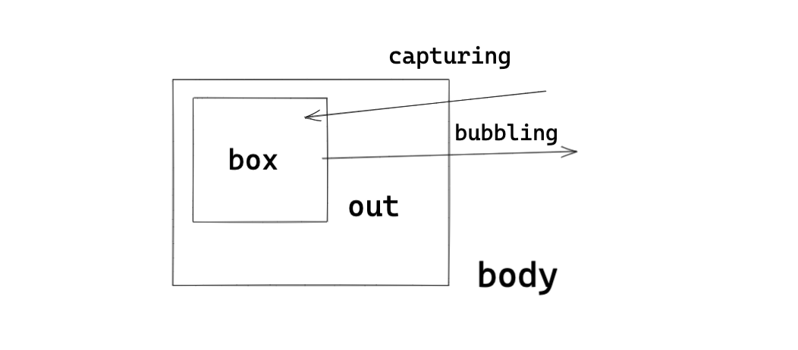

# DOM

網頁中最重要的就各種標籤元素，透過這些標籤瀏覽器才將畫面正確的渲染出來，而 JavaScript 是通過 Document Object Model （DOM，文檔物件模型）來操作這些標籤。

DOM 呈現如以下的架構：


下一層級的會繼承上一層的屬性和方法，最上層的 EventTarget 是用於處理事件監聽的。


## Node

透過 Node 中內建的屬性和方法能夠輕鬆獲取 dom 元素的類型：

```js
const divEl = document.querySelector('div')

// 常見的屬性
console.log(divEl.nodeName, divEl.nodeType)
```

也能夠對 dom 元素進行操作：

```js
const divEl = document.querySelector('div')
const strongEl = document.createElement('strong')
strongEl.textContent = '我是 strong 元素'

// 插入元素
divEl.appendChild(strongEl)
```


## Document

Document 中有常見的屬性如：title、location 等，以及創建元素和獲取元素的方法。

創建元素：

```js
const imageEl = document.createElement('img')
// 相等
// const imageEl2 = new Image()
```

獲取元素：

```html
<div id="div" name="div">123</div>
```

```js
// 透過 id
const divEl0 = document.getElementById('div')
// 透過元素標籤，取全部
const divEl1 = document.getElementsByTagName('div')
// 透過 name 屬性，取全部
const divEl2 = document.getElementsByName('div')
// 透過選擇器，只取第一個
const divEl3 = document.querySelector('div')
// 透過選擇器，取全部
const divEl4 = document.querySelectorAll('div')
```


## Element

常見的 element 屬性，如 id 、tagName、clientWidth，能夠獲取元素上的資訊，並可以用內建的方法來設置屬性和獲取屬性：

```js
divEl.setAttribute('my-name', 'Louis')
const value = divEl.getAttribute('my-name')

// Louis
console.log(value)
```


## 事件監聽

在 JavaScript 與瀏覽器交互，其中最重要的一個手段就是事件監聽，常見的監聽方式有幾種。

有這樣一標籤元素：

```html
<div class="box"></div>
```

可以直接在標籤元素上進行事件監聽：

```html
<div class="box" onclick="console.log('div被點擊')"></div>
```

或者另外寫一函數：

```html
<div class="box" onclick="divClick()"></div>

<script>
  function divClick() {
    console.log('div 元素被點擊')
  }
</script>
```

透過獲取元素的方式並給予屬性監聽點擊：

```js
const divEl = document.querySelector('.box')
divEl.onclick = function() {
  console.log('div元素被點擊')
}
```

添加監聽事件進行點擊監聽，這是目前最主流的方式，因為可以針對同一個元素作多次監聽：

```js
const divEl = document.querySelector('.box')
divEl.addEventListener('click', () => {
  console.log('div元素被點擊')
})
```


## 事件冒泡和事件捕獲

瀏覽器的事件流監聽方式默認是由內層的元素向外層發散，這個順序稱之為事件冒泡（Event Bubble），還有另一種順序是從外層到內層，這種稱為事件捕獲。

之所以會有兩種不同的處理流是在因為在早期瀏覽器開發時，IE 和 Netscape 採取了相反的事件流設計方式。



```js
const spanEl = document.querySelector('.box')
const divEl = document.querySelector('.out')

// 事件冒泡
spanEl.addEventListener('click', () => {
  console.log('事件冒泡，span 元素被點擊了')
})
divEl.addEventListener('click', () => {
  console.log('事件冒泡，div 元素被點擊了')
})
document.body.addEventListener('click', () => {
  console.log('事件冒泡，body 元素被點擊了')
})

// 事件捕獲
spanEl.addEventListener('click', () => {
  console.log('事件捕獲，span 元素被點擊了')
}, true)
divEl.addEventListener('click', () => {
  console.log('事件捕獲，div 元素被點擊了')
}, true)
document.body.addEventListener('click', () => {
  console.log('事件捕獲，body 元素被點擊了')
}, true)
```


## 事件物件的屬性和方法

透過監聽事件能夠獲取到 event 事件物件：

```js
const boxEl = document.querySelector('.box')

// 事件冒泡
boxEl.addEventListener('click', (event) => {
  console.log('box 元素被點擊了', event)
})
```

常見的屬性：

- type：事件的類型，如 click
- target：為當前觸發事件的元素
- currentTarget：為處理事件監聽的元素
- offsetX：距離當前事件元素的 x 軸
- offsetY：距離當前事件元素的 y 軸

常見的方法：

- preventDefault：阻止元素的默認行為
- stopPropagation：依照先捕獲和冒泡的順序，終止事件的下一步傳遞
- stopImmediatePropagation：阻止同一個被監聽的元素響應多次