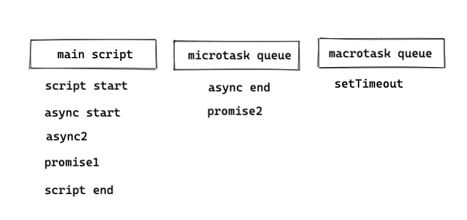

# Event loop

在了解事件循環之前，必須先有進程和線程這兩個概念：

- 進程（process）：計算機已經運行的程序，是操作系統管理程序的一種方式。
- 線程（thread）：操作系統能夠運行運算調度的最小單位，通常情況下包含在進程中。

可以認為，啟動一個應用程序就會啟動一個以上的進程，而每一個進程中至少有一個以上的線程。

## 瀏覽器中的 JavaScript 線程

瀏覽器本身是多進程的，當開啟一個新的頁面都會獨立開啟一個新的進程，這是為了防止一個頁面卡死造成所有頁面無法響應，每個進程中又包含很多線程，其中包含執行 JavaScript 的線程。

由於 JavaScript 程式碼是在**單線程**中執行的，意味著在如果執行某個複雜的操作，當前線程就會被**堵塞**，某些真正耗時的操作，比如**網路請求**、**定時器**是透過**其他線程**完成的，執行 JavaScript 的線程中會實現一個事件循環，只要在其他線程執行完畢時回調即可。

事件循環中維護著兩個隊列：

- 宏任務隊列（macrotask queue）
- 微任務隊列（microtask queue）


在執行任何一個宏任務之前，都會查看是否有微任務需要執行，並保證微任務隊列是空的。

假設有以下程式碼：

```js
async function async1() {
  console.log('async start')
  await async2()
  console.log('async end')
}

async function async2() {
  console.log('async2')
}

console.log('script start')

setTimeout(function () {
  console.log('setTimeout')
})

async1()

new Promise(function (resolve) {
  console.log('promise1')
  resolve()
}).then(function () {
  console.log('promise2')
})

console.log('script end')
```

可以按照上面的任務進行區分：



打印順序依序為：main script => microtask queue => macrotask queue

## Nodejs 中的 JavaScript 線程

Nodejs 中的事件循環是由 libuv 來實現的。

事件循環類似一個橋樑，連接 JavaScript 和系統調用之間的通道，無論是文件讀取、定時器、子進程，在完成對應的操作後，都會將對應的結果和回調函數放到事件循環中，事件循環會不斷的從任務隊列中取出對應的事件（回調函數）來執行。

一次完整的循環分成多個階段：

- 定時器（Timers）
- 待定回調（Pending Callback）
- Idle、prepare
- 輪詢（Poll）
- 檢測（Poll）
- 檢測（check）
- 關閉的回調函數

Nodejs 中的事件循環相對更為複雜，也分成微任務和宏任務，並且隊列也做出更多的細分，執行順序由上至下：

- 微任務

  - Next tick queue：process.nextTick
  - Other queue：Promise 的 then 回調、queueMicrotask

- 宏任務
  - Timer queue：setTimeout、setInterval
  - Poll queue：IO 事件
  - Check queue：setImmediate
  - Close queue：close 事件

```js
async function async1() {
  console.log('async start')
  await async2()
  console.log('async end')
}

async function async2() {
  console.log('async2')
}

setTimeout(() => {
  console.log('setTimeout0')
})

setTimeout(() => {
  console.log('setTimeout2')
}, 300)

setImmediate(() => console.log('setImmediate'))

process.nextTick(() => console.log('nextTick1'))

async1()

process.nextTick(() => console.log('nextTick2'))

new Promise(function (resolve) {
  console.log('promise1')
  resolve()
  console.log('promise2')
}).then(function () {
  console.log('promise then')
})

console.log('script end')
```

按照 Nodejs 中的任務隊列進行區分，由於 setTimeout2 延遲 300 毫秒加入所以最後執行：


