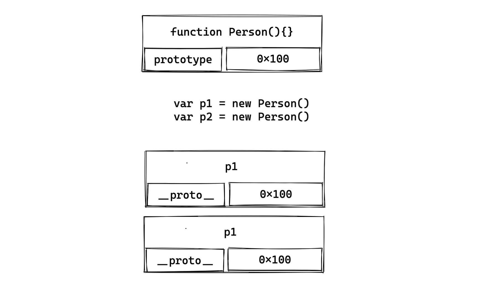

# 物件和原型

JavaScript支持了多種程式設計的範式，包含函數式編程（ Functional Programming ）和物件導向編程（ Object-oriented programming ）：

- JavaSciprt中的物件被設計成一組**屬性的無序集合**，類似一個哈希表，由key和value組成。

- Key是一個標識符名稱，value可以是任意類型，也可以是**物件或者函數類型**

- 如果值是一個函數通常稱之為**方法**

  

## 如何創建物件

透過new關鍵字：

```js
var obj = new Object()

obj.name = "Louis"
obj.age = 19
```

透過字面量的方式：

```js
var obj = {
  name: 'Louis',
  age: 19
}
```


## 如何操作物件

基本的操作方式如下：

```js
var obj = {
  name: 'Louis',
  age: 26
}

// 獲取
obj.name

// 賦值
obj.name = 'XXX'

// 刪除
delete obj.name
```


## 物件本身的方法

除了直接操作外，物件本身也提供了一些方法調用，以下對常見的方法進行介紹：

### Object.defineProperty

使用Object.defineProperty對物件屬性進行更加精確的操作，Object.defineProperty允許傳入三個參數：

- obj： 要定義屬性的物件。
- prop：要被定義或修改的屬性名字。
- descriptor：要定義或修改物件敘述內容。

descriptor為物件的屬性描述器，屬性描述器（Property descriptor）主要有兩種：資料描述器（data descriptor）與訪問描述器（accessor descriptor），共有以下幾個屬性：

- configurable

  `true` 則此屬性將可改變或刪除。 **預設為 `false`**

- enumerable

  `true` 如果物件被列舉，將會列舉此屬性。 **預設為 `false`**

一個資料描述器有以下屬性：

- value

  屬性的值，**預設 [`undefined`](https://developer.mozilla.org/zh-TW/docs/Web/JavaScript/Reference/Global_Objects/undefined).**

- writable

  `true` 則該物件屬性可透過[賦予運算子](https://developer.mozilla.org/en-US/docs/Web/JavaScript/Reference/Operators#assignment_operators)改變其值。 **預設 `false`**

一個訪問描述器有以下屬性:

- get

  獲取屬性時調用。 **預設 [`undefined`](https://developer.mozilla.org/zh-TW/docs/Web/JavaScript/Reference/Global_Objects/undefined)**

- set

  修改屬性時調用。. **預設 [`undefined`](https://developer.mozilla.org/zh-TW/docs/Web/JavaScript/Reference/Global_Objects/undefined)**

一個簡單的資料描述器使用案例：

```js
var obj = {
  name: 'Louis',
  age: 26
}

Object.defineProperty(obj, "height", {
  configurable: true,
  enumerable: true,
  writable: true,
  value: 1.75
})

console.log(obj.height)
```

一個簡單的訪問描述器使用案例：

```js
var obj = {
  name: 'Louis',
  age: 26,
  _height: 1.75
}

Object.defineProperty(obj, "height", {
  configurable: true,
  enumerable: true,
  get: function() {
    return this._height
  },
  set: function(value) {
    this._height = value
  }
})

console.log(obj.height)

```

訪問描述器也可直接在物件中進行定義：

```js
var obj = {
  name: 'Louis',
  age: 26,
  _height: 1.75,
  get height() {
    return this._height
  },
  set height(value) {
    this._height = value
  }
}
```


### Object.defineProperties

透過 Object.defineProperties 可以一次定義多個屬性：

```js
var obj = {
  _age: 19
}

Object.defineProperties(obj, {
  name: {
    configurable: true,
    enumerable: true,
    writable: true,
    value: "Louis"
  },
  age: {
    configurable: false,
    enumerable: false,
    get: function(){
      return this._age
    },
    set: function(value) {
      this._age = value
    }
  }
})
```


### 其他的方法

- Object.getOwnPropertyDescriptor：獲取某一個特定屬性的屬性描述器。
- Object.getOwnPropertyDescriptor ：獲取整個物件所有屬性的屬性描述器。
- Object.preventExtensions：禁止物件添加新的屬性。
- Object.seal：禁止對物件配置或刪除屬性。
- Object.freeze： 禁止對物件中屬性的值進行修改


## 創建物件的方案

### 字面量

使用字面量直接定義物件是最直接的方式：

```js
var p1 = {
  name: '張三',
  age: 18,
  height: 1.88,
  address: "台北",
  eating: function() {
    console.log(this.name + '在吃東西')
  },
  running: function() {
    console.log(this.name + '在跑步')
  }
}
```


### 工廠函數

透過定義一個創建函數可以在創建大量相似物件的同時，重複利用相當程度的程式碼：

```js
function createPerson(name, age, height, address) {
  var p = {
    name,
    age,
    height,
    address,
    eating: function() {
      console.log(this.name + '在吃東西')
    },
    running: function() {
      console.log(this.name + '在跑步')
    }
  }
  return p
}

var p1 = createPerson('張三', 18, 1.88, '台北')
var p2 = createPerson('李四', 18, 1.88, '新竹')
var p3 = createPerson('王五', 18, 1.88, '桃園')
```

以上透過 createPerson 返回的物件仍然是以字面量的形式存在，相對來說使用構造函數去定義物件是一個更好的方法。


### 構造函數

透過 new 操作符去調用函數時該函數就稱之為構造函數，構造函數能讓物件的類型獲得更加嚴格的約束。

如果一個函數使用 new 操作符去調用，那會執行以下操作：

1. 創建一個空的物件（ 即 {} ）；
2. 為新創建的物件添加 `__proto__` ，同時函數的 prototype 會該屬性進行引用；
3. 構造函數的內部的 this 會指向新創建的物件；
4. 如果該函數沒有返回值，則返回 this。

通常構造函數開頭**首字母**會特意命名為**大寫**以和普通函數做區分：

```js
function Person(name, age, height, address) {
  this.name = name
  this.age = age
  this.height = height
  this.address = address
  this.eating = function() {
    console.log(this.name + '在吃東西')
  },
  this.running = function() {
    console.log(this.name + '在跑步')
  }
}

var p1 = new Person("Louis", 25, 1.75, "新北市")
var p2 = new Person("Jenny", 20, 1.7, "台北市")
```

不過仍然有缺點，就是在每次 new 創建新的物件時，物件是完全新建的，類似於 eating 或是 running 等函數其實沒必要創建新的佔據更多的內存空間，這時候就可以利用函數的 prototype。


### 原型（ Prototype ）

每個物件中都存在一個 prototype 屬性，這個屬性稱之為物件的原型（ 隱式原型 ）。

可以使用 `__proto__` 屬性或是 ES5 提供的 Object.getPrototypeOf 方法查看。

在 JavaScript 中函數也是物件，不過相對於一般的物件來說，函數會多出一個 prototype 屬性 ( 顯示原型 ) 。

函數的 prototype 中也存在一個屬性 constructor（ 建構子 ），constructor 是指向上層 prototype 的，意即兩者之間互相循環引用。

如果執行這一段程式碼：

```js
function foo() {
}

// 函數有隱式原型
console.log(foo.__proto__)

// 函數也有顯示原型
console.log(foo.prototype)

var f1 = new foo()
var f2 = new foo()

// 以下皆相等
console.log(f1.__proto__ === foo.prototype)
console.log(f2.__proto__ === foo.prototype.constructor)
```

打印出來的會是兩個 true ，也就是 new 出來的物件內部的 `__proto__`其實都是指向相同一塊[記憶體位址](https://zh.wikipedia.org/zh-tw/記憶體位址)，如下圖：



也就是如果無論在物件的`__proto__`或是函數上的 prototype 上進行修改都能對所有 new 出來的物件進行修改：

```js
f1.__proto__.name = 'Louis'
// 輸出 Louis
console.log(f1.name)
console.log(f2.name)
```

意即：

```js
foo.__proto__.name = 'Louis'
// 輸出 Louis
console.log(f1.name)
console.log(f2.name)
```

也可以進行整個物件替換，不過要補上 constructor 對 prototype 的指向：

```js
foo.prototype = {
  name: "Louis",
}

// 可以通過 Object.defineProperty 方式添加 constructor
Object.defineProperty(foo.prototype, "constructor", {
  enumerable: false,
  configurable: true,
  writable: true,
  value: foo
})
```

所以可以對構造函數創建物件的方式使用原型進行優化：

```js
function Person(name, age, height, address) {
  this.name = name
  this.age = age
  this.height = height
  this.address = address
}

Person.prototype.eating = function() {
  console.log(this.name + '在吃東西')
}

Person.prototype.running = function() {
  console.log(this.name + '在跑步')
}


var p1 = new Person("Louis", 25, 1.75, "新北市")
var p2 = new Person("Jenny", 20, 1.7, "台北市")
```

