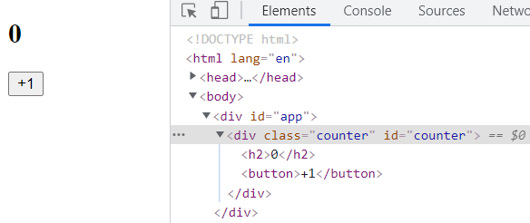

# Vue3響應式原理

Vue的三大核心模塊：

- Compiler模塊(編譯系統)

  編譯template的系統，分為Runtime + Compiler和Runtime-only兩種，通常我們會使用Runtime-only，讓vue-loader幫我們將template轉化一般的javascript程式碼，也就是render函數

- Render模塊(渲染系統)

  主要的工作是透過render函數生成vnode節點(虛擬DOM由多個vnode組成)，並且會進行diff算法更新被修改的vode節點

- Reactivity模塊(響應式系統)

  組件內部會依賴一些，而數據改變時Reactivity模塊會調用render函數使vnode更新


三個模塊是這樣協同工作的

- Compiler模塊會將template在編譯階段轉化成不同的render函數
- Render模塊將不同的render函數生成對應的vnode節點(虛擬DOM由多個vnode組成)，並將虛擬DOM渲染成真實DOM
- Reactivity模塊會監測數據的變化，如果出現變化會通知Render模塊
- Render模塊會對比新舊虛擬DOM的差別，然後使用diff算法將相應的vnode節點進行更新


## 實現一個渲染系統

要實現一個簡單的渲染系統包含以下幾點

- 定義h函數來返回vnode節點
- mount函數進行掛載
- patch函數比對更新舊節點

### 定義h函數來返回vnode節點

首先來寫一個h函數來定義一個vnode節點，一個vnode節點中應該包含tag(html標籤)、prop(屬性，EX: id、class、placeholder或者是監聽函數)、children(子節點)

```js
const h = (tag, props, children) => {
  return {
    tag,
    props,
    children
  }
}
```

### mount函數進行掛載

然後我們要寫一個mount函數將vnode掛載至頁面上，在這個mount函數中我們應該傳入兩個東西，一個vnode節點、一個是要掛載的標籤，這個函數要做的事情有以下幾點

- 在vnode節點中新增一個對應真實dom節點的屬性
- 將props轉為相對應的屬性以及透過addEventListener監聽事件的發生
- 遞歸將vnode內的子節點轉換成真實dom
- 最後透過appendChild這個函數掛載到對應的標籤內

```js
const mount = (vnode, container) => {
  const el = vnode.el = document.createElement(vnode.tag)

  // 處理props
  if(vnode.props) {
    for(const key in vnode.props) {
      const value = vnode.props[key]
      if(key.startsWith('on')) {
        el.addEventListener(key.slice(2).toLowerCase(), value)
      } else {
        el.setAttribute(key, value)
      }
    }
  }


  // 處理children
  if(vnode.children) {
    if(typeof vnode.children === "string") {
      el.textContent = vnode.children
    } else {
      for(let item of vnode.children) {
        mount(item, el)
      } 
    }
  }

  // 將el掛載的container上
  container.appendChild(el)
}
```

我們可以透過mount函數掛載vnode，以下做一個示例

html

```html
<div id="app"></div>
```

js

```js
// 通過h函數創建vnode
const vnode = h("div", {class: "counter", id: "counter"}, [
    h("h2", null, "0"),
    h("button", {onClick: () => {counter++}}, "+1")
])

// 通過mount函數 將vnode掛載到#app上
mount(vnode, document.querySelector('#app'))
```

實際呈現的結構會是這樣的



### patch函數比對更新舊節點

還要實現一個比對新舊節點，進行diff算法更新的patch函數，由於patch函數比較複雜，所以我們一步步拆開來看

這個path函數將有兩個參數一個n1(舊節點)、一個是n2(新節點)，n1作為舊節點我們前面已經透過mount函數賦予了一個新的對應真實dom的屬性

```js
const patch = (n1, n2) => {
 ...
}
```

我們第一步可以先判斷這兩個新舊節點的標籤是否一樣，如果不同我們可以直接對拿到舊節點的父元素，然後對整個舊節點進行替換

```js
if (n1.tag !== n2.tag) {
    const parentNode = n1.el.parentNode
    parentNode.removeChild(n1.el)
    mount(n2, parentNode)
} else {
    ...
}
```

但是如果新舊節點的差別只有一點呢? 我們可以透過算法直接找到區別的地方進行替換就好，而這裡我們要先將獲取節點所對應的真實dom以方便之後修改並將舊節點對應真實dom的屬性保存到n2的屬性中

```js
const el = n2.el = n1.el
```

然後對比新舊屬性的區別，並進行真實dom的更新

```js
// 處理props
const oldProps = n1.props || {};
const newProps = n2.props || {};
// 獲取所有新節點的props加到對應的元素中 如果判斷新舊props相同的就不用加
for (const key in newProps) {
  const oldValue = oldProps[key];
  const newValue = newProps[key];
  if (oldValue !== newValue) {
      // 對是否為on開頭的事件監聽做判斷
    if (key.startsWith("on")) {
      el.addEventListener(key.slice(2).toLowerCase(), newValue);
    } else {
      el.setAttribute(key, newValue);
    }
  }
}

// 刪除舊的props
for (const key in oldProps) {
   // 舊的事件要被移除掉避免多次掛載
  if (key.startsWith("on")) {
    el.removeEventListener(key.slice(2).toLowerCase(), oldProps[key]);
  }
   // 判斷新的props有沒有這個key，
  if (!(key in newProps)) { 
    el.removeAttribute(key);
  }
}
```

接下來要處理新舊節點中各自的children，會有幾種可能，如果新的children是字符串最簡單，直接把舊的children用innerHTML替換掉就好，當然我們可以做更多的判斷，比如新舊children是否都是文本

```js
const oldChildren = n1.children;
const newChildren = n2.children;

// 情況一: newChildren本身是字符串
if (typeof newChildren === "string") {
  // 可以考慮更多的edge case(邊緣情況判斷)
  if (typeof oldChildren === "string") {
    if (oldChildren !== newChildren) {
      el.textContent = newChildren;
    }
  } else {
    el.innerHTML = newChildren;
  }
} else {
   ...
}
```

如果舊的children是字串而新的children是一個陣列(就是由多個h函數所組合的vnode)，可以直接遍歷然後進行mount掛載

```js
 // oldChildren是字串就直接清空並進行掛載
if (typeof oldChildren === "string") {
  el.innerHTML = ""
  newChildren.forEach(item => {
    mount(item, el)
  })
} else {
  ....
}
```

如果新舊children都是陣列，就需要對陣列中的每個vnode進行比對，

> oldChildren: [vnode1, vnode2, vnode3]
>
> newChildren: [vnode4, vnode5, vnode6]

首先我們獲取新舊children最小的陣列長度，直接比對各個vnode進行更新，如果有新的children比較多就直接使用mount函數進行掛載，舊的children比較多則要移除

```js
const commonLength = Math.min(oldChildren.length, newChildren.length)
for(let i = 0; i < commonLength; i++) {
    // console.log(i)
    patch(oldChildren[i], newChildren[i]) // 比對新舊節點進行更新
}

if(newChildren.length > oldChildren.length) { // 新節點的數量大於舊節點 對多出的節點進行掛載
  newChildren.slice(oldChildren.length).forEach(item => {
    mount(item, el)
  })
}

if(newChildren.length < oldChildren.length) { // 舊節點的數量大於舊節點 對多出的節點進行刪除
  oldChildren.slice(newChildren.length).forEach(item => {
    el.removeChild(item.el)
  })
}
```


## 如何實現一個響應式系統

### Dep類

響應式的核心就是透過一個叫做dep的類實現依賴收集，所以我們首先要定義類，內部存放依賴這個變數的所有函數，當變數改變時這些函數也會被重新執行

```js
class Dep {
  constructor() {
    // subscribers中存放所有對應的依賴 
    // 使用集合這樣的數據格式
    this.subscribers = new Set() 
  }

  // 負責收集依賴
  depend() {
    if(activeEffect) {
      this.subscribers.add(activeEffect)
    }
  }

  // 通知依賴更新
  notify() { 
    this.subscribers.forEach(effect => {
      effect()
    })
  }
}
```

### 數據劫持

而如何監測數據改變呢，Vue3使用proxy對物件中各屬性的變化進行劫持，proxy中有兩個方法get和set，參數是target(物件)和key(屬性)

通過這個reactive函數能劫持數據中的所有屬性，當屬性被調用或重新設置時都會調用getDep這個函數，獲取相應的dep類

```js
// 透過reactive函數進行數據劫持
function reactive(raw) {
  return new Proxy(raw, {
    get(target, key) {
      const dep = getDep(target, key)
      dep.depend()
      return target[key]  // proxy中target物件並非原物件 所以不會照成循環引用的問題
    },
    set(target, key, newValue) {
      const dep = getDep(target, key)
      target[key] = newValue
      dep.notify()
    }
  })  
}
```

getDep函數是這樣的，使用weakmap這樣的結構來儲存該reactive物件對應的dep類，weakmap的好處是如果key值為null，對應的key和value都會被自動回收

```js
// 一般的map中key是一個字符串
// weakmap中的key是一個物件 並且是弱引用的 意思是當key賦值為null時 這個key和對應的value都會被取消掉(垃圾回收)
// 用weakmap是要將對應的原始數據做為key
const targetMap = new WeakMap()
function getDep(target, key) {

  // 跟據傳入的target取targetMap中的dep集合
  let depsMap = targetMap.get(target)
  if(!depsMap) {
    depsMap = new Map()
    targetMap.set(target, depsMap)
  }

  // 從dep集合中取出key對應的dep
  let dep = depsMap.get(key)
  if(!dep) {
    dep = new Dep()
    depsMap.set(key, dep)
  }

  return dep
}
```

### watchEffect

然後，我們還可以寫一個watchEffect函數來對傳入watchEffect內部的函數進行依賴收集

```js
// 透過watchEffect這個函數加入dep的依賴中
let activeEffect = null
function watchEffect(effect) {
  activeEffect = effect
  effect() // 第一次自動執行
  activeEffect = null
}
```


## 實現一個createApp函數

最後要實現一個入口以供外部進行調用，示例:

```js
const createApp = (rootComponent) => {
  return {
    mount(selector) {
      const container = document.querySelector(selector)
      let isMounted = false
      let oldVnode = null
      watchEffect(function() {
        // 判斷是否已經被掛載到dom上
        if(!isMounted) {
          oldVnode = rootComponent.render()
          mount(oldVnode, container)
          isMounted = true
        } else {
          const newVnode = rootComponent.render()
          patch(oldVnode, newVnode)
          oldVnode = newVnode
        }
      })
    }
  }
}
```